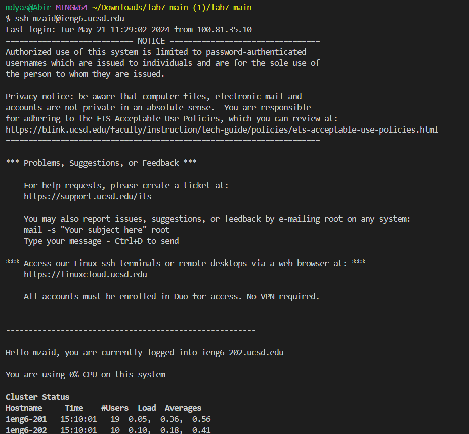
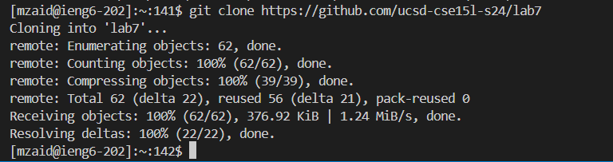
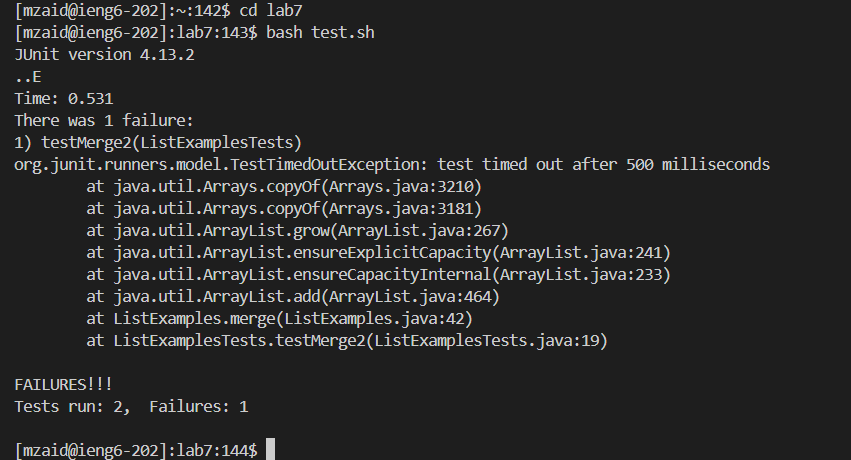
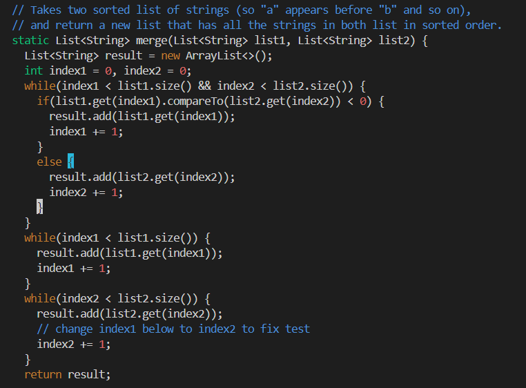
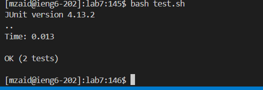
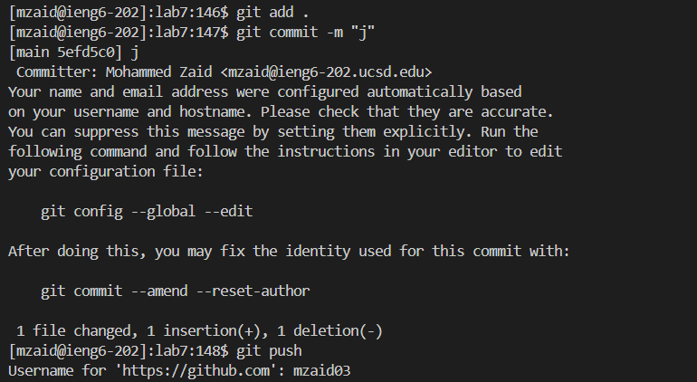

Lab Report 4 - Vim (Week 7)

Step 4:

Keys pressed: ssh `mzaid@ieng6.ucsd.edu` <enter>   This is the step for logging into your ieng account.

Step 5:

Keys pressed: git clone <control V> <enter>  This is the step for cloning a repository and the control v was essentially pasting the link

Step 6:

Keys pressed: cd lab7 <enter>, bash test.sh <enter>. The first command was essentially to change the directory to lab7. Enter to input it. And the the next command was test.sh which was to run the test.

Step 7:

Keys pressed: vim ListExamples, <enter> 43 times j, 5 times l, i, x, 2, esc, :wq and <enter>. The first command was essnetially to open vim and access the file. The second step was to navigate around where j is down, l is to go to the right, i to insert, x to delete, 2 to insert 2 for 1 and esc to go to normal mode. Finally, :wq then <enter> to go back to terminal.

Step 8:

Keys pressed: bash test.sh, <enter>. This is to run the test again after editing.

Step 9:

Keys pressed: 
