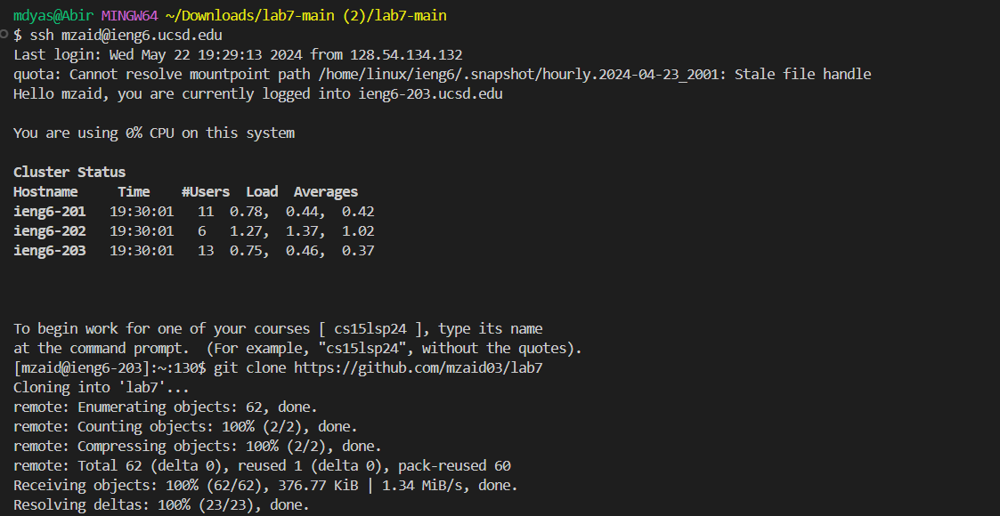
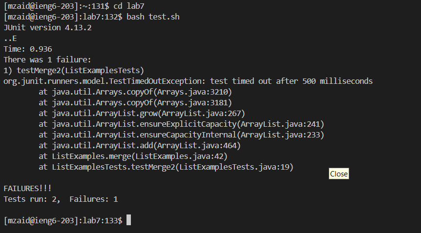
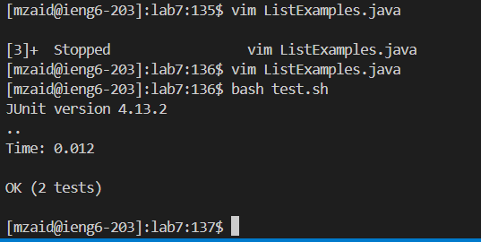

Lab Report 4 - Vim (Week 7)

Keys pressed: `j, j, j, j, j, j, j, j, j, j, j, j, j, j, j, j, j, j, j, j, j, j, j, j, j, j, j, j, j, j, j, j, j, j, j, j, j, j, j, j, j, j, j, j, j, j, j, j, j, j, j, j, l, l, l, l, l, l, l, l, l, l, l, l, l, l, l, l, l, l, l, l, l, l, l, l, l, l, l, l, l, l, l, l, l, l, l, l, l, l, i, x, 2, esc, :wq`

For the commands I ran, I started off on line 1 so I had to go down to line 44 to fix the code and make the changes. So I had to press `j` in order to go down and then press `l` in order to go to the right and I had to press it 12 times since it is 12 characters/spaces to the right and when I got to the part which I had to change I pressed `i` to insert or edit the file and then I pressed `x` to delete the character I wanted to change which in this case was the `index1` which I changed to `index2` to make the `bash test.sh` work. Then I pressed `esc` in order to go back to the normal mode and then I pressed `:wq` in order to save and quit my work.
